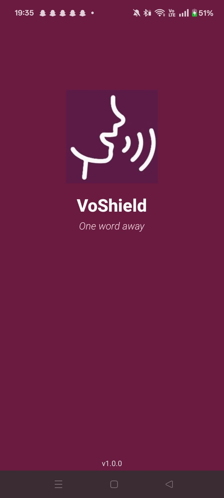
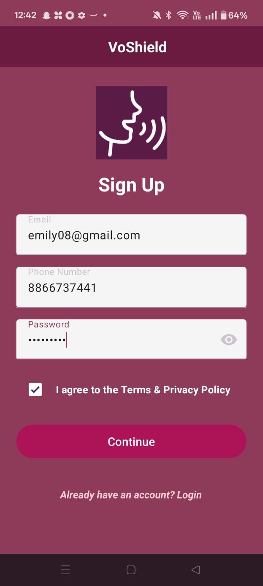
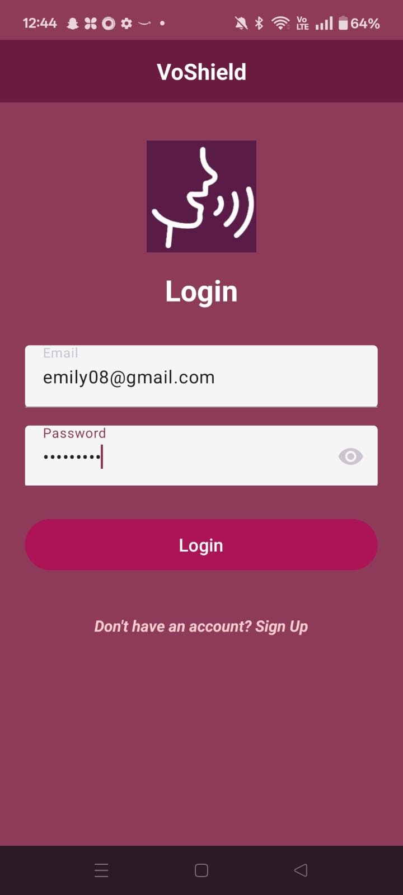
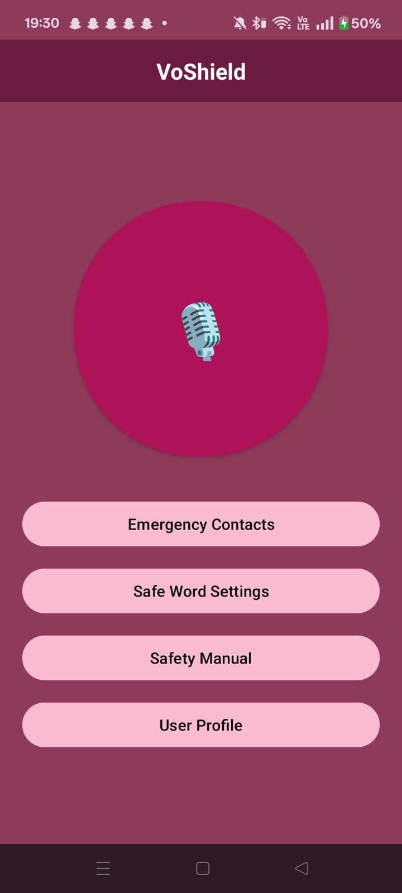
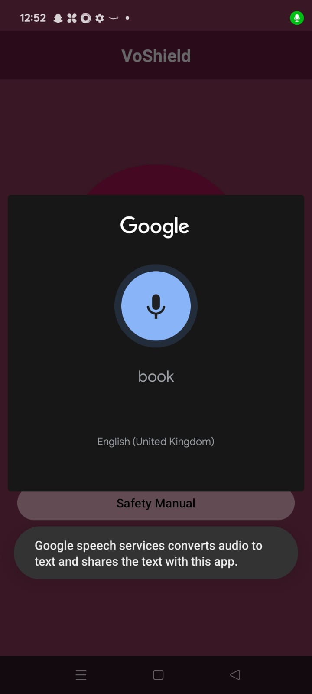
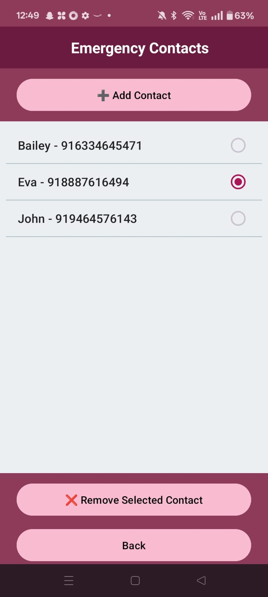
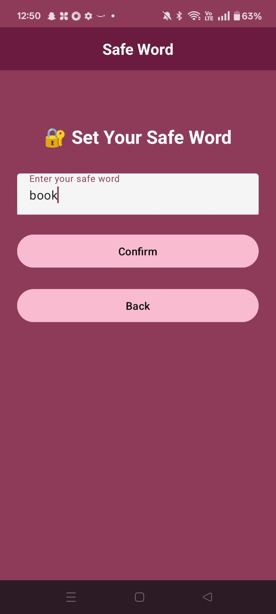
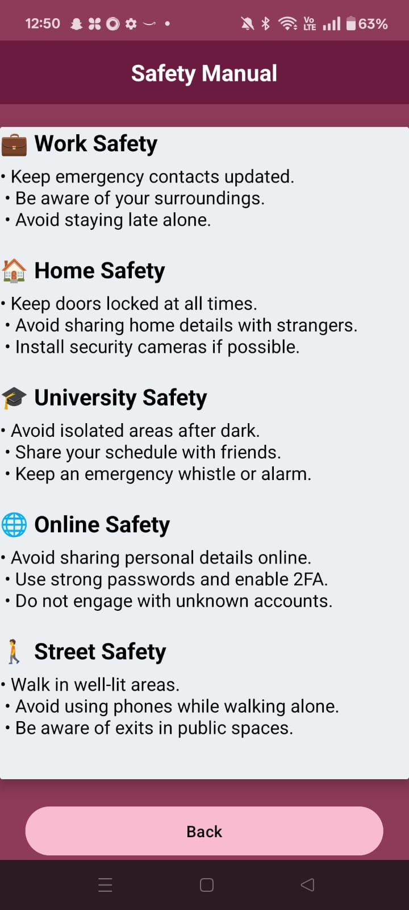
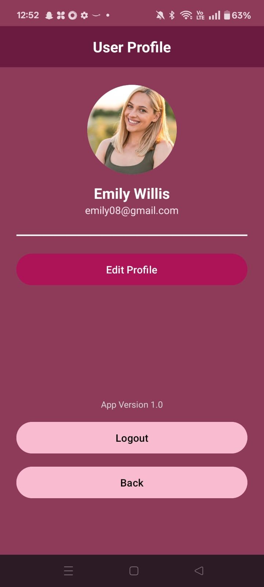
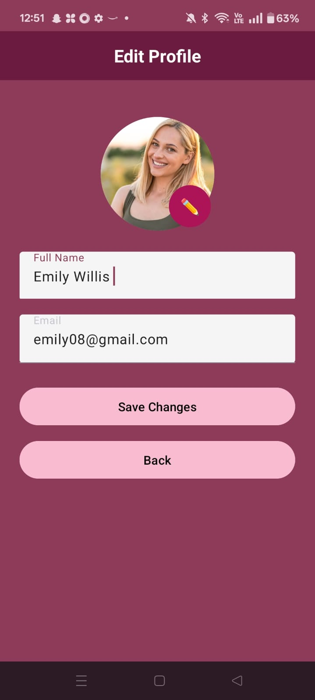

 VoShield: AI-Powered SOS Voice-Recognition Emergency App

**VoShield** is an Android application that **demonstrates the use of Artificial Intelligence** through **voice recognition** for personal safety. Designed as a **portfolio project**, it showcases how AI can be used to detect voice-based SOS triggers, making real-time emergency handling more accessible.

---

🤖 Powered by AI

This project uses:

🎙️ **Android Speech Recognition API**  
  - Integrates **AI-powered speech-to-text** to convert user speech into commands.  
  - Listens for a **custom safe word** defined by the user to initiate future emergency protocols.

---

📲 Preview


| Main | Signup | Login | Menu |
|------|--------|-------|------|
|  |  |  |  |

| Voice Recognition | Emergency Contacts | Safe Word | Safety Manual |
|------------------|--------------------|-----------|----------------|
|  |  |  |  |

| User Profile | Edit Profile |
|--------------|--------------|
|  |  |

---

🚀 Key Features

- ✅ **Safe Word with Voice Recognition**  
  User defines a safe word. AI listens for it using Android’s SpeechRecognizer.

- 👤 **User Profile System**  
  Add profile image, edit name, and view account details using local storage.

- 📚 **Safety Manual**  
  Curated safety tips across multiple categories: home, work, street, online, university.

- 📞 **Emergency Contact Picker**  
  Add/remove emergency contacts from the phone book and store them securely.

- 🔐 **Login/Logout Functionality**  
  Session management using `SharedPreferences`.

- ✨ **Modern Material UI**  
  Clean, user-friendly design with smooth transitions and a custom theme.

---

 🎯 Project Objective

> **To demonstrate the real-world application of AI — specifically voice recognition — in building socially relevant mobile apps.**

 Future Scope Includes:
- Background listening for SOS safe word  
- Emergency alert with GPS coordinates  
- Real-time auto communication with emergency contacts  

---

🛠️ Tech Stack

| Layer        | Tech                                    |
|--------------|------------------------------------------|
| Language     | Java                                     |
| IDE          | Android Studio                           |
| AI Used      | Android SpeechRecognizer API             |
| UI Framework | XML, Material Components                 |
| Storage      | SharedPreferences                        |
| Permissions  | Contacts, Microphone, Media Access       |

---

🧪 Future Enhancements

- 🎧 Passive voice recognition (runs in background)
- 🗺️ GPS sharing and tracking
- 🆘 Emergency alert system (SMS/email)
- 🔐 Firebase-based cloud login

---

🔧 How to Run

1. Clone the repository:
   ```bash
   git clone https://github.com/your-username/voshield.git
   cd voshield
